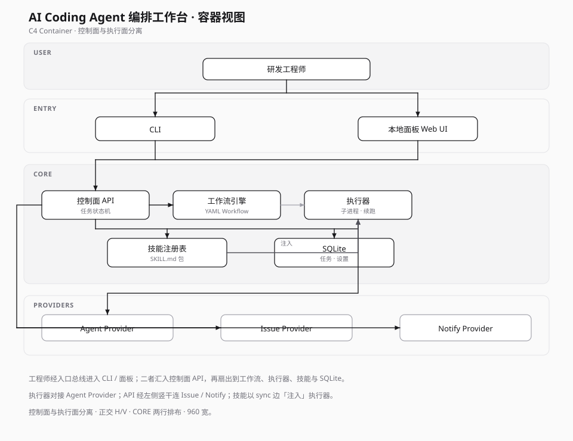

# Container — AI Coding Agent 编排工作台

展示可独立部署 / 运行的技术积木：CLI、本地面板、任务与工作流引擎、本地存储、技能包与各类 Provider。

## 要点

- **控制面与执行面分离**：API / 状态机可观测；执行器只负责拉起 Agent 子进程与回收。
- **Schema 优先**：任务、工作流、设置结构可交换，支撑内网 Python 形态与开源 TS monorepo 同源演进。
- **技能是一等公民**：以包形式分发，而不是写死在某一条流水线里。

## 源文件

- [containers.svg](./containers.svg) — 主展示
- Mermaid 草稿已弃用
