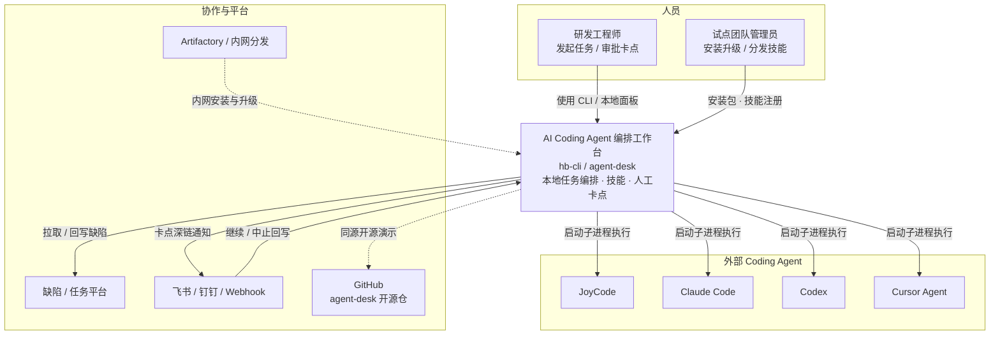

# System Context — AI Coding Agent 编排工作台

展示本系统与使用者、外部 Coding Agent、缺陷/通知/分发系统的边界。

## 要点

- **系统在本地**：控制面与执行器跑在工程师机器上，避免把仓库与密钥默认送上远端黑盒。
- **Agent 是外部可替换单元**：统一 Provider 收口差异，而不是绑死某一家 CLI。
- **人在环路**：关键节点经通知深链回到工作台，形成「Agent 提议、人来批准」。
