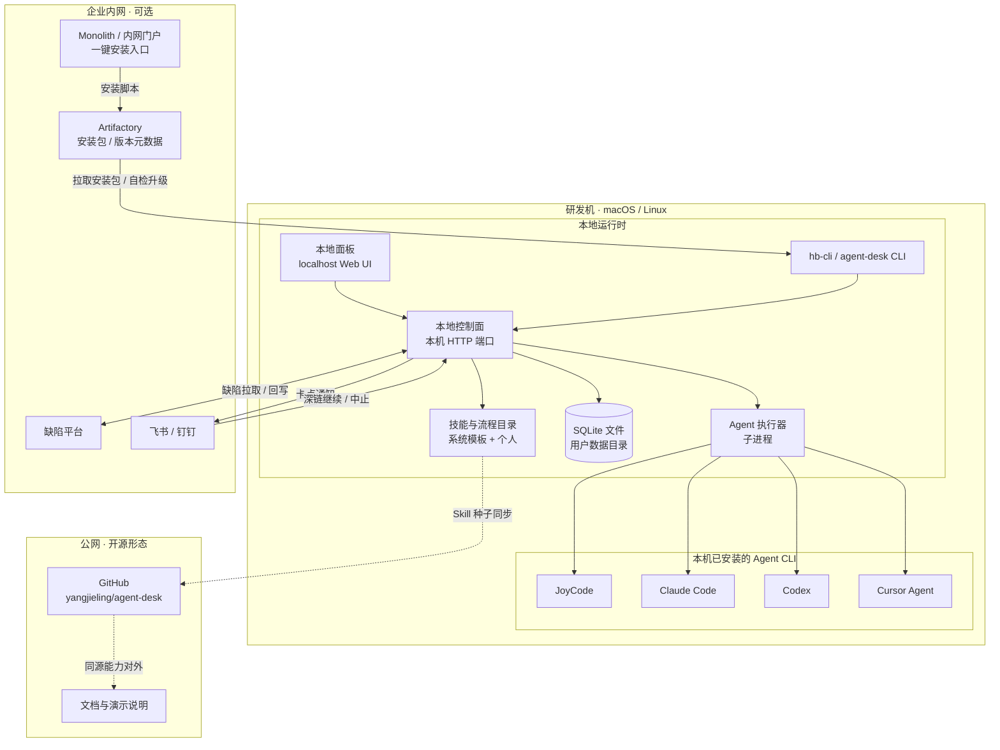

# Deployment — AI Coding Agent 编排工作台

部署视角：日常运行在**研发本机**；内网通过 Artifactory 分发安装包与技能；开源侧以 GitHub 仓库对外演示同源能力。

## 部署说明

| 区域 | 跑什么 | 说明 |
|------|--------|------|
| 研发机 | CLI、面板、控制面、执行器、SQLite | 默认形态；数据与日志留在本地 |
| 本机 Agent CLI | JoyCode 等 | 由执行器按 Provider 拉起，不托管在远端集群 |
| 企业内网 | Artifactory、安装入口、缺陷与 IM | 负责分发升级与协同回写，不是把 Agent 会话搬上云 |
| 公网 | agent-desk 仓库 | 演示可插拔 Provider 与 Schema，降低内外网分叉 |

## 为何不是「全家桶上 K8s」

本产品定位是**本地 harness**：优先可观测、可中断、可带人工卡点。容器/K8s 更适合集中式平台类项目；此处刻意把运行时压在开发者环境，分发层只负责安装包与技能版本。
