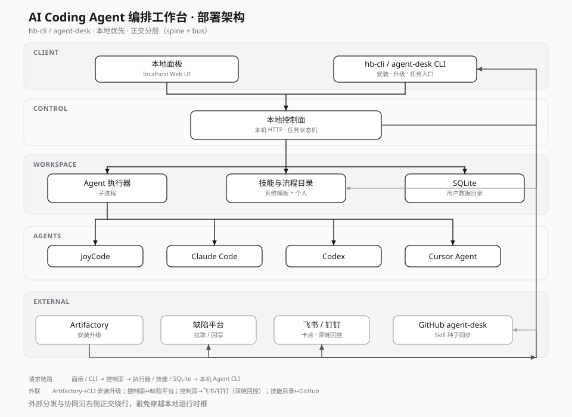

# Deployment — AI Coding Agent 编排工作台

## 读图说明

| 层 | 职责 |
|----|------|
| CLIENT | 本地面板与 CLI，任务入口与安装升级 |
| CONTROL | 本机 HTTP 控制面与任务状态机 |
| WORKSPACE | 执行器子进程、技能目录、SQLite 本地数据 |
| AGENTS | 本机已安装的 Agent CLI（按 Provider 拉起） |
| EXTERNAL | Artifactory 分发、缺陷 / IM 协同、GitHub 技能种子 |

请求链路：面板 / CLI → 控制面 → 执行器 / 技能 / SQLite → 本机 Agent CLI。外部分发与协同沿右侧正交绕行；飞书 / 钉钉经深链回控。Skill 同步为技能目录与 GitHub 之间的独立中右竖廊标注，避免与 SQLite / Agent 混淆。

## 为何不是「全家桶上 K8s」

本产品定位是**本地 harness**：优先可观测、可中断、可带人工卡点。容器/K8s 更适合集中式平台类项目；此处刻意把运行时压在开发者环境，分发层只负责安装包与技能版本。

## 源文件

- `deploy.svg` — 主展示（正交 spine + bus，推荐）
