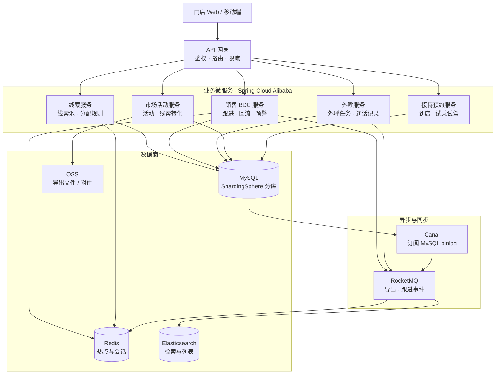

# Container — 4S 店销售 BDC 平台

按「接入 → 业务服务 → 异步与同步 → 数据」四层展开；箭头以自上而下为主，减少交叉。

## 要点

- **责任链**落在销售 BDC：下次跟进、预警、回流等分配规则挂在跟进流程上（图中不展开细节）。
- **Canal + MQ** 保证 MySQL → Redis / ES 的近实时一致，支撑检索与列表读路径。
- 导出走 MQ + OSS，避免大导出拖垮核心跟进链路。
