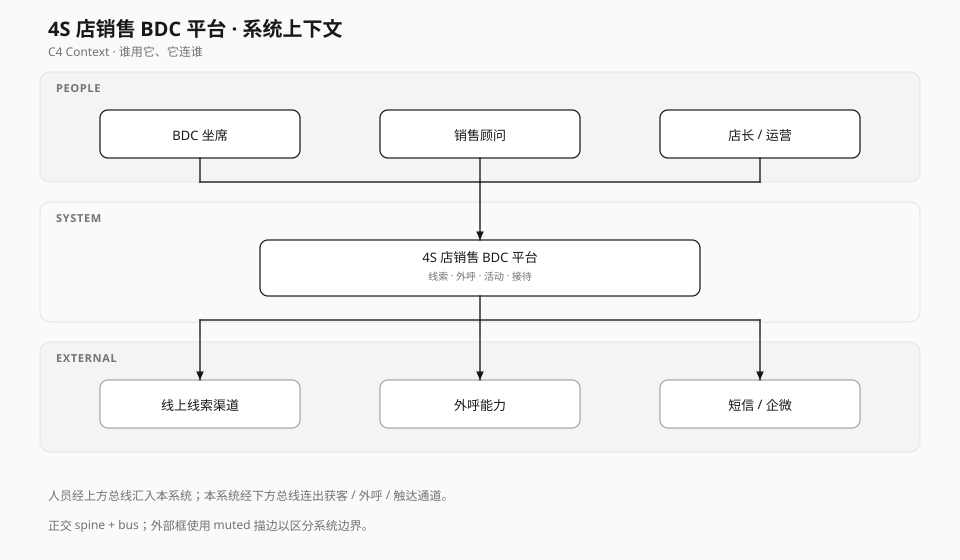

# System Context — 4S 店销售 BDC 平台

系统边界外只有「谁用它、它连谁」；内部微服务细节见容器图。

## 要点

- 平台服务**经销商门店角色**，不是 C 端车主 App。
- 外部只保留三类：获客入口、外呼通道、触达通道，避免把支付/金融等后续链路塞进 Context。

## 源文件

- [context.svg](./context.svg) — 主展示
- Mermaid 草稿已弃用
