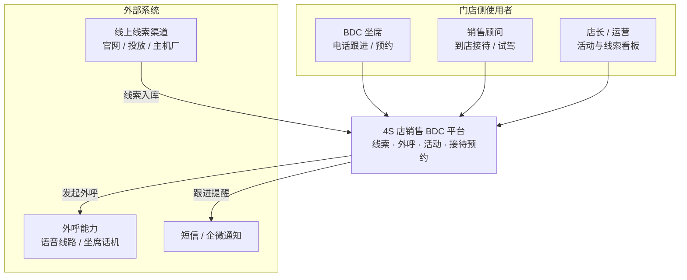

# System Context — 4S 店销售 BDC 平台

系统边界外只有「谁用它、它连谁」；内部微服务细节见容器图。

```mermaid
flowchart TB
  subgraph Users["门店侧使用者"]
    BDC["BDC 坐席<br/>电话跟进 / 预约"]
    Sales["销售顾问<br/>到店接待 / 试驾"]
    Mgr["店长 / 运营<br/>活动与线索看板"]
  end

  Platform["4S 店销售 BDC 平台<br/>线索 · 外呼 · 活动 · 接待预约"]

  subgraph External["外部系统"]
    Lead["线上线索渠道<br/>官网 / 投放 / 主机厂"]
    Call["外呼能力<br/>语音线路 / 坐席话机"]
    SMS["短信 / 企微通知"]
  end

  BDC --> Platform
  Sales --> Platform
  Mgr --> Platform
  Lead -->|线索入库| Platform
  Platform -->|发起外呼| Call
  Platform -->|跟进提醒| SMS
```

## 要点

- 平台服务**经销商门店角色**，不是 C 端车主 App。
- 外部只保留三类：获客入口、外呼通道、触达通道，避免把支付/金融等后续链路塞进 Context。
