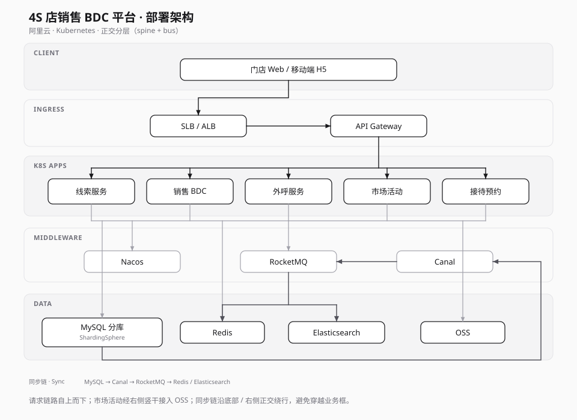

# Deployment — 4S 店销售 BDC 平台

## 读图说明

| 层 | 职责 |
|----|------|
| 客户端 | 门店人员访问入口（Web / 移动端 H5） |
| 接入 | SLB / ALB + API Gateway，统一鉴权与路由 |
| 应用 | 业务微服务，容器化跑在 Kubernetes |
| 中间件 | Nacos 注册配置、RocketMQ 消息、Canal binlog 同步 |
| 数据 | MySQL 分库（ShardingSphere）、Redis、Elasticsearch、OSS |

请求链路自上而下；应用经共享 bus 接入中间件与数据面。同步链单独正交绕行：`MySQL → Canal → RocketMQ → Redis / Elasticsearch`。

## 源文件

- `deploy.svg` — 主展示（正交 spine + bus，推荐）
- Mermaid 草稿已弃用：自动绕线杂乱，不利于一屏阅读
