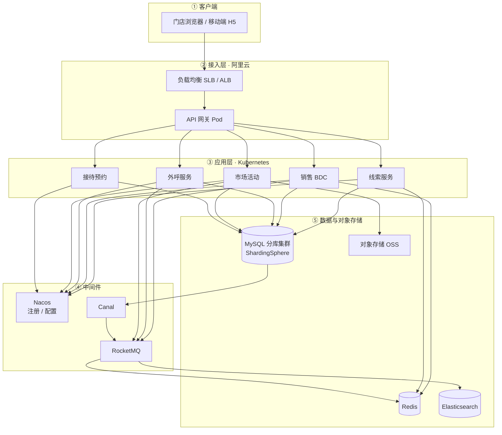

# Deployment — 4S 店销售 BDC 平台

部署图刻意做成**自上而下五层**：客户端 → 入口 → K8s 应用 → 中间件 → 数据存储。层与层之间单向连接，避免左右大框互穿。

## 读图说明

| 层 | 职责 |
|----|------|
| 客户端 | 门店人员访问入口 |
| 接入 | SLB + 网关，统一鉴权与路由 |
| 应用 | 业务微服务，容器化跑在 K8s |
| 中间件 | 注册配置、消息、binlog 同步 |
| 数据 | 分库 MySQL、缓存、检索、对象存储 |

## 设计取舍

- **一层一行**，不用「左右大框对打」。
- **关系尽量竖直向下**；同步链路 `MySQL → Canal → MQ → Redis/ES` 单独成一条。
- 节点控制在一屏可读；金融/交车等后链路不进部署图（业务流程图里已有）。
